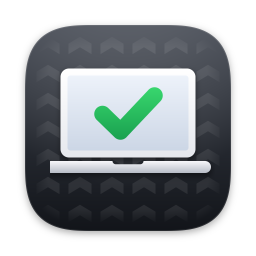
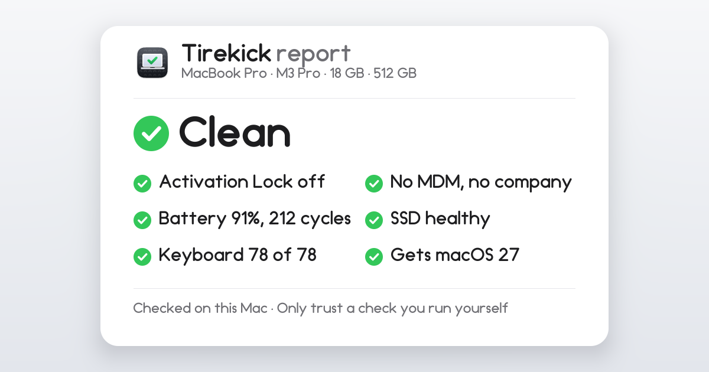

<p align="center"></p>

<h1 align="center">Tirekick</h1>

<p align="center"><b>Kick the tires on a used Mac before you pay.</b><br>
Locks, battery, SSD, keys, screen and updates in two minutes. Free, open source, offline.</p>

> **Walk away.** Assigned to “Acme Corp” in Apple Business. After it's erased, it will lock itself to them again.
> Only that organization can release it.

Open Tirekick on a second-hand Mac and it tells you, in plain English:

- whether the Mac is still tied to someone's Apple Account (Activation Lock), managed by an organization (MDM), or
  assigned to a company that will take it back after it's erased (Apple Business, formerly Apple Business Manager, or
  Apple School Manager);
- how worn the battery and SSD are;
- whether the specs match the listing;
- whether it still gets macOS updates.

Then it walks you through keyboard, display, speaker, microphone, camera and trackpad tests, and makes a report card
you can share.

<p align="center"></p>

**Status: in development.** The first tester beta is on its way; until then nothing here has run on a real Mac. See
[CHANGELOG.md](CHANGELOG.md).

## What it checks

Every check runs one of Apple's own tools, with fixed arguments, and shows you the exact command and its raw output.
"Walk away" is kept for hard facts; everything else is a finding for you to weigh.

| Check | Exact command (or file) | Verdict |
|---|---|---|
| Activation Lock | `/usr/sbin/system_profiler -json SPHardwareDataType` (`activation_lock_status`) | On: **walk away**, unless the seller turns off Find My in front of you and it checks again as off |
| Managed by an organization (MDM) | `/usr/bin/profiles status -type enrollment` | Enrolled via DEP or MDM: **walk away** (unless it's your employer's Mac) |
| Assigned to a company | `sudo /usr/bin/profiles show -type enrollment`, which **you** run in Terminal and paste back. Tirekick never asks for your password. | An organization is named: **walk away**. "Client is not DEP enabled" (no organization has set it to enroll): OK. Any error: couldn't check, never "OK" |
| What you're buying | `/usr/sbin/system_profiler -json SPHardwareDataType`, `/usr/sbin/system_profiler -json SPDisplaysDataType` (GPU cores), `/usr/sbin/sysctl hw.model hw.memsize hw.nperflevels hw.perflevel0.name hw.perflevel0.physicalcpu hw.perflevel1.name hw.perflevel1.physicalcpu machdep.cpu.brand_string`, and a model list built into the app | You compare it with the listing: doesn't match, **check** |
| Battery | `/usr/sbin/system_profiler -json SPPowerDataType`, `/usr/sbin/ioreg -r -c AppleSmartBattery -a` | Maximum capacity below 80%, macOS says "Check Battery", or a permanent failure: **check**. Cycles shown against the battery's rating (1,000 on recent Macs) |
| SSD | `/usr/sbin/system_profiler -json SPStorageDataType`, `/usr/sbin/system_profiler -json SPNVMeDataType` | SMART "Verified": OK. Failing: **walk away** |
| macOS updates | The built-in model list and the running macOS version | Apple silicon: gets macOS 27. Intel: its last macOS (26 at most; 13 for most 2017 models, 15 for the iMac Pro), **check** |
| Seller: signed out of iCloud | The number of accounts in `~/Library/Preferences/MobileMeAccounts.plist` (read, never written; never which account) | Still signed in: **check** |
| Seller: FileVault | `/usr/bin/fdesetup status` | Off: **check** |

Those five executables are the whole list. CI rejects any other path, any shell or other way to start a process
(`NSTask`, `Process.run`, `system`, `popen`, `posix_spawn`, `exec`), and the common network APIs.

## Guided tests

Keyboard (ANSI and ISO, every key lights up; keys macOS keeps for itself get a tick-it-yourself fallback), display
(full-screen colors and a checkerboard), speakers (left, right, both), microphone (level meter), camera (live preview)
and trackpad (click, Force Click, two-finger scroll). Each ends with Pass, Problem or Skip. Camera and microphone
access is asked for only when you open those tests, and nothing is recorded or saved.

## The report card

Save it as PNG or PDF, or copy it as text. The serial number is masked to its last 4 characters by default, and it
never includes a user name, computer name or Apple Account. The PDF adds every command and its raw output. Every card
ends with "Only trust a check you run yourself": a picture is easy to edit, and the app is free.

## What it can't tell you

- Whether the Mac was reported lost or stolen. No public lookup exists.
- Whether an Intel Mac has a firmware password (reading it needs root).
- Parts and repair history, and liquid damage.
- Whether the seller owns it.

## It will never help bypass MDM or Activation Lock

Tirekick doesn't remove, hide or work around either, and never will. A "bypass" leaves the Mac in the organization's
account, so the lock can come back. Only the owner can turn off Activation Lock, and only the organization can release
a Mac it owns. Pull requests that add anything else will be closed.

## Privacy

**Runs offline. Sends nothing. Reads nothing personal. Changes nothing.** No network access at all (no analytics, no
crash reporting, no update check). Tirekick itself stores no settings and writes no files except a report you save;
like any Mac app, macOS may remember its window position and last save folder. Details:
[privacy policy](https://everydayopen.github.io/tirekick/privacy/).

## Install

Download `Tirekick.dmg` from [the website](https://everydayopen.github.io/tirekick/download/) or
[Releases](https://github.com/EverydayOpen/tirekick/releases), open it and drag Tirekick to Applications, or run it
straight from the disk image or a USB stick. macOS 13 or later, Apple silicon or Intel. Releases are signed with a
Developer ID and notarized by Apple. (Unsigned `-beta` pre-releases are for invited testers.)

If the Mac is at the setup screen, finish setup connected to Wi-Fi or a hotspot with a throwaway local account first.
If setup shows a Remote Management screen or asks for someone else's Apple Account, you already have your answer. Macs
that stop at macOS 12 can't run Tirekick: the [meetup checklist](https://everydayopen.github.io/tirekick/guides/used-mac-meetup-checklist/)
has the same checks by hand.

## Build from source (on a Mac)

```sh
brew install xcodegen
xcodegen generate
open Tirekick.xcodeproj
```

Run the **Tirekick** scheme. Re-run `xcodegen generate` after adding or removing files, or after editing `project.yml`.

## Tests

```sh
swift test                                  # on a Mac: Core and Mac tests
swift test --filter TirekickCoreTests       # anywhere with Swift 6.2+: Core only
bash tools/test_core_docker.sh              # Core only, in Docker (Windows Git Bash too)
python tools/changelog.py --self-test
python tools/build_site.py --check
bash tools/doctor.sh                        # what's configured and what's left before go-live
```

CI runs all of these, the app build on macOS, and the safety greps. The **fixtures** workflow dumps every allowlisted
command's real output on GitHub's arm64 and Intel runners, which become Core test fixtures.

## Help test it

Tirekick reads output from many Mac models and macOS versions. If a check says "Couldn't check" or looks wrong, open an
[issue](https://github.com/EverydayOpen/tirekick/issues) and paste what Help › Copy Raw Data copies: every command and its
output, with the serial number and hardware identifiers masked. Each one becomes a test fixture.

## Repository layout

```
Package.swift            SwiftPM package: TirekickCore (Foundation-only, builds on Linux) + TirekickMac (macOS only)
Sources/TirekickCore/    model, parsers, verdict rules, built-in model list, report text
Sources/TirekickMac/     the collector (the only code that runs a process) and the hardware-test engines
Tests/                   TirekickCoreTests (with real command output in Fixtures/), TirekickMacTests
App/                     SwiftUI app target, Info.plist, entitlements, assets
project.yml              XcodeGen spec (Tirekick.xcodeproj is generated, never committed)
site/                    the website and guides (site.json holds the base URL)
tools/                   build_site.py, changelog.py, make_icon.py, make_og.py, doctor.sh, test_core_docker.sh
.github/workflows/       ci, fixtures, beta, release, site
docs/                    BUILD_PLAN.md (the contract), RELEASING.md, GO_LIVE.md
```

`python tools/make_icon.py` redraws the app icon; `python tools/make_og.py` then redraws the website's images. Both are
standard-library Python.

## License

[MIT](LICENSE) © 2026 EverydayOpen. Apple, Mac, MacBook, macOS and iCloud are trademarks of Apple Inc. Tirekick is
not affiliated with or endorsed by Apple Inc.
